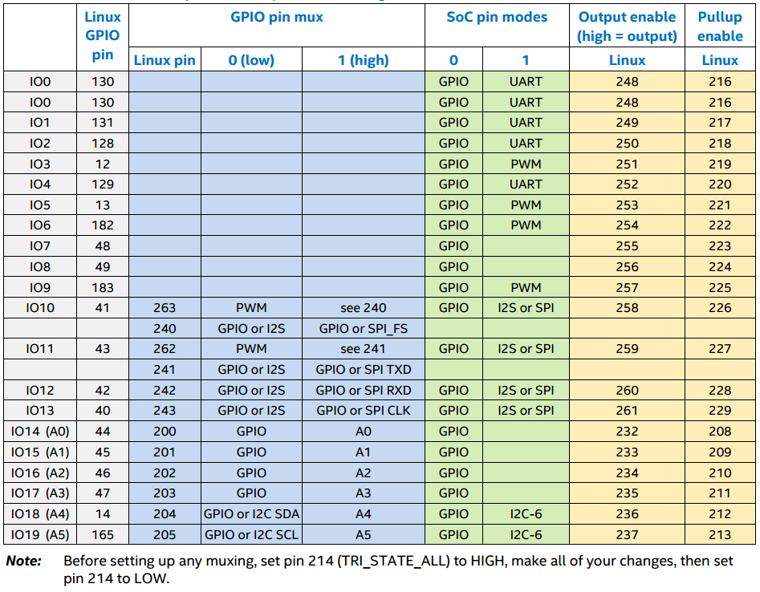
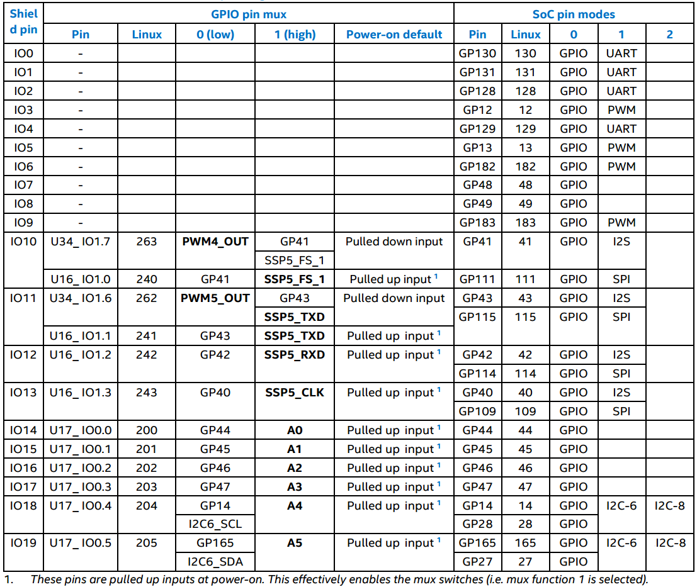
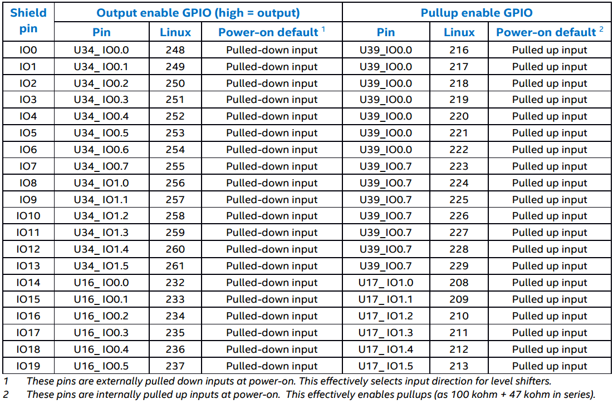

# Pin Multiplexor

## What is pin multiplexing?

Some pins on the Intel® Edison may be configured with one well-defined purpose, others are able to support variety of functions including general-purpose I/O\(GPIO\), I2C, PWM, SPI , ADC among others.

**Pin multiplexing** is the process of selecting a specific function for a particular multi-function shield pin.

However in some cases it can do more that just select the function. Other options for the pin include connecting to pull-up or pull-down resistors to bias a line to a specific value. Some pins can be configured to detect input signal changes and generate an interrupt or a wakeup event.

## How to MUX?

All GPIO pins on the Arduino\* header require some internal GPIOs to be set up before the pin is usable. This is usually as simple as setting an output enable, pullup enable, and mode. However, some pins have extra functionality such as SPI, PWM, or I2C, so these pins need extra multiplexing \(muxing\) in order to be usable.

Table 1 shows this such that a programmer can easily see all the muxing pins affected for a given Arduino\* header pin. The color codes in the table show related boxes. For example, the blue boxes are meant to show the relationship between the pin mux pins and the pin modes. This table is a synopsis of the more detailed tables below, which contain extra information, such as schematic pin numbers, pins used for muxing, etc. For most needs, this synopsized table should suffice.

**Table1 Arduino\* pin mux and pin mode settings**



### Muxing Control

Table 2 lists the GPIO outputs dedicated to pin multiplexing control. Different functions may be selected for specific shield I/O pins by setting these GPIO outputs to 0/1 \(low/high\). Additionally, some of the SoC GPIO pins also feature internal mux options. These are listed as “SoC Pin Modes”.

Currently, these are configured by setting the required pin mode for the corresponding SoC GPIO pin N, via /sys/kernel/debug/gpio\_debug/gpioN/current\_pinmux, to “mode\[0/1/2/...\]”

**Table2 Pin Function Miltiplexing Control**



**Note**: Sheild Pins IO10 and IO11 as PWM:

```text
Depends on PWM swizzler. The SoC offers only four PWM pins. A jumper pin matrix labeled “PWM swizzler” on the baseboard
```

allows these four pins to be connected to any subset of the six shield-header pins normally used for PWM. From the factory, IO3, IO5, IO6, and IO9 will be connected to the four available SoC PWM pins as described above. You can manually alter these to connect IO10 or IO11.

### Pin Direction & Pull-Up Control

For most shield pins on the Intel® Edison kit for Arduino\*, there is a buffer/level-shifter which needs to be configured for input or output direction, and an external 47 kohm pullup/pulldown resistor, which may be optionally enabled. Both are driven by dedicated GPIO outputs, listed in Table 3. When configuring a shield pin as an output, we advise configuring the buffer for output before setting the SoC GPIO pin direction to output. To disconnect the external pullup/pulldown resistors, it is necessary to configure as high-impedance inputs the GPIOs that drive them. Note also that the GPIO signals from the PCAL9555A GPIO expanders have internal 100 kohm pullup resistors, which are connected to the GPIO pins by default. These need to be disabled in many cases, by configuring those pins as high-impedance inputs.

**Table3 Pin Direction and pull-up control**



## Let's MUX-it!

So how all this comes together?, how can we use the aforementioned tables, to configure the GPIO pins for certain functionality required by our project?. Well if these are the kind of questions you have, you are in the right place.

Trying to figure out how all this fits together at first sight may look a little bit overwhelming and it is just in appearance, in a nutshell the steps to configure a given GPIO, bases in the use of Table1 & Table2 with the following steps:

1. Make a list of the GPIO's involved in the setup you want to configure. 3. The GPIO you want to use needs GPIO pin mux configuration? 4. Write down every GPIO needed and the value to which the "direction" attribute should be set \(possible values: in, out, high, low\) \(how to set GPIO attributes?--&gt;link to GPIO primer\) 4. A pin mode needs to be set? 6. Write down the GPIO in charge of setting the pin mode, and the value which the "current\_pinmux" attribute should be set \(possible values: mode\[0/1/2/...\]”\) \(how to set GPIO attributes?--&gt;link to GPIO primer\) 4. What GPIO controls its input direction? 5. What GPIO enables/disables the pullup-resistor?
2. Export all the pins in your list \(how to export?--&gt;link to GPIO primer\)
3. **Before** setting up any muxing, set GPIO 214 \(TRI\_STATE\_ALL\) to HIGH
4. Set the value of each exported GPIO according to the desired configuration.
5. **After** making all of your changes, then set

   GPIO 214 \(TRI\_STATE\_ALL\)  to LOW.

Now let's take a look at a couple examples on how to apply these rules:

#### Example1: Configure IO5 as a GPIO input, with pull-up resistor disabled

Alright!, for this first example I would like to take you step by step:

1. Make a list of the GPIO's involved in the setup you want to configure. 3. Does the GPIO you want to use need a GPIO pin mux configuration?

   `NO, according to Table1 the IO's 0-->9 does not require any pin-mux configuration`

   * Does the pin mode need to be set?

     `YES, According to Table1, IO5 corresponds to GPIO10, which has two modes, one as GPIO and other as PWM. For our example we need it configured as GPIO.`

   * What GPIO controls its input direction?

     `According to Table1/Table3, GPIO253. Since high = output and low = input, the value for the "direction" attribute should be "low" to fullfill the example's requirement`

   * What GPIO enables/disables the pullup-resistor?

     `According to Table1/Table3, GPIO221. Since in = disable and out = enable, the value for the "direction" attribute should be "in" to fullfill the example's requirement`

     So basically the GPIO list that we need, is as follows:

     ```text
     13  <-- the GPIO that maps to IO5
     253 <-- GPIO that controls direction, by setting "direction" to "low" will configure GPIO13 as input
     221 <--GPIO that enables/disables pull-up resistor, by setting "direction" attribute to "in" wil disable GPIO13 pull-up resistor
     214 <--We always need to export this GPIO, if it is not already exported.
     ```

2. Export all the pins in your list \(how to export?--&gt;link to GPIO primer\)

   ```text
   # echo 13 > /sys/class/gpio/export
   # echo 253 > /sys/class/gpio/export
   # echo 221 > /sys/class/gpio/export
   # echo 214 > /sys/class/gpio/export
   ```

3. **Before** setting up any muxing, set GPIO 214 \(TRI\_STATE\_ALL\) to HIGH

   `# echo high > /sys/class/gpio/gpio214/direction`

   **NOTE**: _before trying to export GPIO 214, you can verify if it already appears as a GPIO \(take a look to GPIO primer\), if you try to export it a message like this could appear: **-sh: echo: write error: Device or resource busy**_

4. Set the value of each exported GPIO according to the desired configuration.

   ```text
   # echo low > /sys/class/gpio/gpio253/direction
   # echo in > /sys/class/gpio/gpio221/direction
   # echo mode0 > /sys/kernel/debug/gpio_debug/gpio13/current_pinmux
   # echo in > /sys/class/gpio/gpio13/direction
   ```

5. **After** making all of your changes, set GPIO 214 \(TRI\_STATE\_ALL\) to LOW.

   `# echo low > /sys/class/gpio/gpio214/direction`

Now, it should be possible to use IO5 as a GPIO input!!

### Example2: Configure IO10 for SPI connectivity \(as output\), pull-up resistor disabled

1. Make a list of the GPIO's involved in the setup you want to configure. 3. Does the GPIO you want to use need a GPIO pin mux configuration?

   `YES, according to Table1 the IO's 10-->19 does requires pin-mux configuration. The IO10 is related to GPIO41, that in turn has the GPIO263 that selects between PWM and "240", that "240" refers to GPIO240, when we take a look at GPIO240 we see it can be configured to select between I2S and SPI. We need SPI.`

   So wrapping up, the GPIO's needed for pin Mux are:

   ```text
    263 <--selects between "PWM" and "240", we need to select "240" by setting the "direction" attribute to "high".
    240 <--selects between "I2S" and "SPI", we want SPI, so we set the "direction" attribute to "high"
   ```

   * Does a pin mode need to be set?

     `YES, According to Table1, we need to select between I2S and SPI, the requirement for this example is SPI, but for IO's 10-->19 we need to take a look to table2 because on depending what GPIO from the pinMux configuration we selected is the GPIO we're going to use to select the pin mode. in this example we are using the GPIO 240 to select SPI, therefore in Table2 we can see that the related GPIO for pin mode when using GPIO 240 is GPIO 111`

   * What GPIO controls its direction \(input/output\)?

     `According to Table1/Table3, GPIO258. Since high = output and low = input, the value for the "direction" attribute should be "high" to fullfill the example's requirement`

   * What GPIO enables/disables the pullup-resistor?

     `According to Table1/Table3, GPIO226. Since in = disable and out = enable, the value for the "direction" attribute should be "in" to fullfill the example's requirement`

     So basically the GPIO list that we need, is as follows:

     ```text
     263 <--This GPIO selects between "GPIO" and "240"; selecting  "240" is what we want in order to enable the GPIO240. To do this we set "direction" attribute to high.
     240 <--This GPIO is enabled by GPIO 263 in order to select between  "I2S" and "SPI". To select SPI we should set "direction" attribute to high
     111 <--Selects the pin-mode, by setting the "current_pinmux" attribute to "mode1" the pin mode will be SPI
     258 <--GPIO that controls direction, by setting "direction" to "high" will configure GPIO41 as output
     226 <--GPIO that enables/dables pull-up resistor, by setting "direction" attribute to "in" will disable GPIO13 pull-up resistor
     214 <--We always need to export this GPIO, if it is not already exported.
     ```

2. Export all the pins in your list \(how to export?--&gt;link to GPIO primer\)

   ```text
   # echo 263 > /sys/class/gpio/export
   # echo 240 > /sys/class/gpio/export
   # echo 111 > /sys/class/gpio/export
   # echo 258 > /sys/class/gpio/export
   # echo 226 > /sys/class/gpio/export
   # echo 214 > /sys/class/gpio/export
   ```

3. **Before** setting up any muxing, set GPIO 214 \(TRI\_STATE\_ALL\) to HIGH

   `# echo high > /sys/class/gpio/gpio214/direction`

   **NOTE**: _before trying to export GPIO 214, you can verify if it already appears as a GPIO \(take a look to GPIO primer\), if you try to export it a message like this could appear: **-sh: echo: write error: Device or resource busy**_

4. Set the value of each exported GPIO according to the required configuration.

   ```text
   # echo high > /sys/class/gpio/gpio263/direction 
   # echo high > /sys/class/gpio/gpio240/direction 
   # echo high > /sys/class/gpio/gpio258/direction 
   # echo in > /sys/class/gpio/gpio226/direction 
   # echo mode1 > /sys/kernel/debug/gpio_debug/gpio111/current_pinmux
   ```

5. **After** making all of your changes, set GPIO 214 \(TRI\_STATE\_ALL\) to LOW.

   `# echo low > /sys/class/gpio/gpio214/direction`

## Links

* [Kernel GPIO documentation](https://www.kernel.org/doc/Documentation/gpio/sysfs.txt)
* [Edison-Arduino GPIO mapping](http://www.intel.com/support/edison/sb/CS-035275.htm)
* [Intel® Edison GPIO Pin Multiplexing Guide](http://www.emutexlabs.com/project/215-intel-edison-gpio-pin-multiplexing-guide)
* [Intel® Edison Connector Pinout](http://akizukidenshi.com/download/ds/intel/edison-module_HG_331189-002.pdf)
* Link Not Available [Arduino Board Schematic](http://www.intel.com/support/edison/sb/CS-035272.htm)
* Is this the correct one for Arduino Board Schematic? [Arduino Board Schematic](http://download.intel.com/support/edison/sb/edison_arduino_hvm_8_26.pdf)
* [MRAA Library Physical pins map to MRAA pin numbers](http://iotdk.intel.com/docs/mraa/v0.6.0/edison.html)
* [Github User TaipeiHackerSpace / Edison](https://github.com/taipeihackerspace/mredison/blob/33f6a61e474fae87c7c2770282ecca7d5fe9f0c4/gpio_setup.sh)
* [Github User edouardrosset  / Edison Script for General Configuration Right After Flashing](https://github.com/edouardrosset/Edison/blob/master/Intel_Edison_postFlash.sh)

